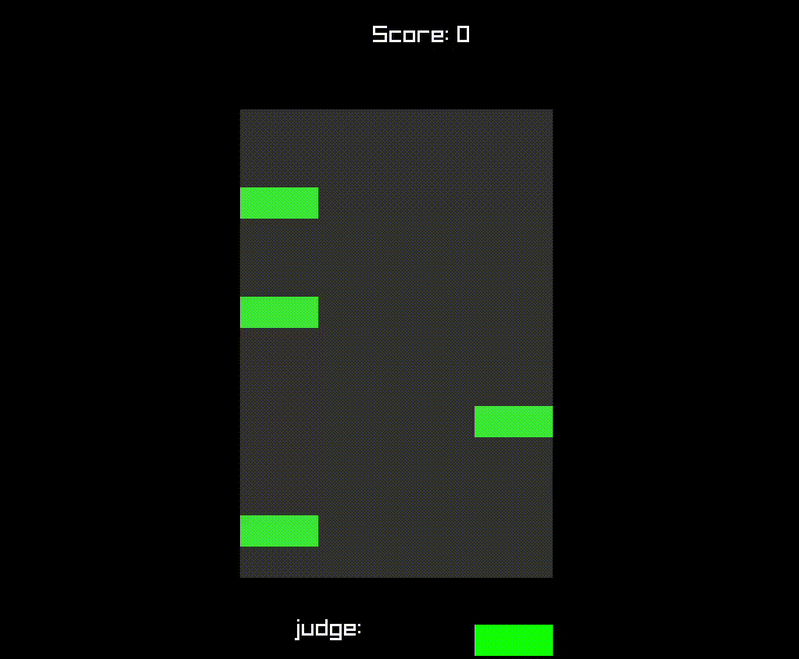

# Beep!Mania

4keys game developed with assembly language and raylib on Linux

GamePlay: Notes fall in straight lines down the screen randomly in 30 seconds(default, you can change it), and players must press the correct key for the corresponding note column.

There are three judgements: Perfect, Great, Good which corresponding to different scores.



## Dependancies

- [raylib](https://github.com/raysan5/raylib)
- [nasm](https://www.nasm.us/pub/nasm/releasebuilds/?C=M;O=D)


## How to start

```
make 
```

then 

```
./beep
```

## Guide

You can change configs of the game:<br>
`speed.txt` : the speed of notes <br>
`time.txt`: the time of game<br>
`key.txt`: keybindings you want to use in the game.<br>
`ESC`: exit the game
<br>

When you change the configuration, you need to recompile it:

easy way:

```
make rebuild
```

or recompile and run:

```
make run
```


*the key files need ASCII code*


